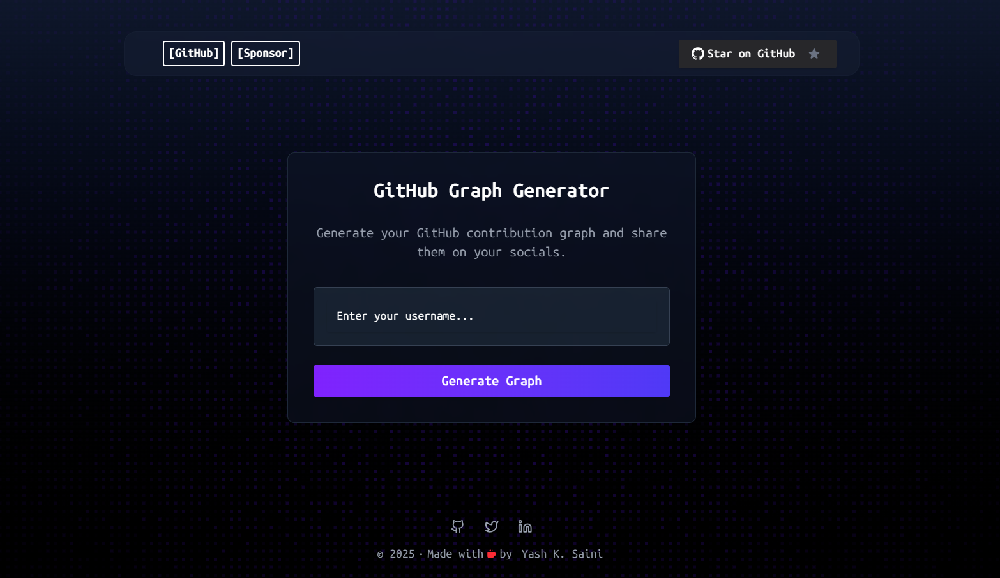

<h1 align="center">Git Graph</h1>

> [!NOTE]
> 
> INTRODUCTION_PARAGRAPH
> Visualize GitHub contributions, allowing users to 
> customize, export, and share their activity as high-quality
> images on Twitter, Instagram, and LinkedIn.

## 📷 Screenshots

> Here's a working and expected screenshot of **_Git Graph_**


| Landing Page  |
|------------|
|  |

---

## 📋 Features

- 📊 **Customizable Graphs**: Customize the graph by selecting from various themes.

- 📈 **Export Graphs**: Export the graph as a high-quality image for sharing on social media.

- 📱 **Responsive Design**: Fully responsive design that works on all devices.

- 🎨 **Themes**: Choose from a variety of themes to customize the graph's appearance.

- 📅 **Date Range**: Select a custom date range to visualize your GitHub contributions.

- 📤 **Share on Socials**: Share your GitHub activity on Twitter, Instagram, and LinkedIn.

- 📊 **2D & 3D**: Get the graph in either 2D or 3D frame style


## 🛠️ Tech Stack

> Git Graph is built using the following powerful technologies:

| Logo | Technology | Description |
|----|------------|-------------|
| | **[TypeScript](https://www.typescriptlang.org/)** | Strongly typed programming language for enhanced development |
|  | **[Next.js](https://nextjs.org/)** | React framework for production-grade applications |
| | **[Octokit](https://github.com/octokit)** | Official GitHub API wrapper for seamless integration |
| | **[Tailwind](https://tailwindcss.com/)** | Utility-first CSS framework for modern designs |
| | **[Vercel](https://vercel.com/home)** | Platform for deploying and hosting web applications |

## 🛣️ Tasks

- [ ] 2D & 3D Graph 
- [ ] JSON Date Parsed 
- [ ] Post on Socials  
- [ ] Themes menu 


## 💻 Contributing

> [!TIP]  
> We welcome contributions to improve **Git Graph**! If you have suggestions, bug fixes, or new feature ideas, follow these steps:

1. **Fork the Repository**  
   Click the **[Fork](https://github.com/yashksaini-coder/git-graph/fork)** button at the top-right of the repo page.

2. **Clone Your Fork**  
   Clone the repo locally:

   ```bash
   git clone https://github.com/yashksaini-coder/git-graph
   ```

3. **Create a Branch**  
   Create a new branch for your changes:

   ```bash
   git checkout -b your-feature-branch
   ```

4. **Make Changes**  
   Implement your changes (bug fixes, features, etc.).

5. **Commit and Push**  
   Commit your changes and push the branch:

   ```bash
   git commit -m "feat(scope): description"
   git push origin your-feature-branch
   ```

6. **Open a Pull Request**  
   Open a PR with a detailed description of your changes.

7. **Collaborate and Merge**  
   The maintainers will review your PR, request changes if needed, and merge it once approved.

## 🙋‍♂️ Issues

Found a bug or need help? Please create an issue on the [GitHub repository](https://github.com/yashksaini-coder/git-graph) with a detailed description.

---

## 📄 License

<p align="center">
<strong>Git Graph</strong> is licensed under the <code>MIT</code> License. See the <a href="https://github.com/yashksaini-coder/git-graph/blob/master/License.md">LICENSE</a> file for more details.
</p>

---

<p align="center">
    <strong>🌟 If you find this project helpful, please give it a star to show support to the Author! 🌟</strong>
</p>


## 👤 Author

<a href="https://github.com/yashksaini-coder">
    <table>
        <tbody>
            <tr>
                <td align="left" valign="top" width="14.28%">
                    
                    <br/>
                    <h4 align="center">
                        <b>Yash K. Saini</b>
                    </h4>
                    <div align="center">
                        <p>(Author)</p>
                    </div>
                </td>
                <td align="left" valign="top" width="85%">
                    <p>
                        👋 Hi there! I'm <u><em><strong>Yash K. Saini</strong></em></u>, a self-taught software developer and a computer science student from India.
                    </p>
                    <ul>
                     <li>
                        I love building & contributing to Open Source software solutions & projects that help solve real-world problems.
                    </li>
                    <li>
                        I want to build products & systems that can benefit & solve problems for many other DEVs.
                    </li>
                </td>
            </tr>
        </tbody>
    </table>
</a>

## 🐳 Docker Usage

You can build and run **Git Graph** inside a Docker container using the [Dockerfile](./Dockerfile) provided in this project.

1. **Build the Docker Image**  
   ```bash
   docker build -t git-graph-image .
   ```

2. **Run a Container**  
   ```bash
   docker run -p 3000:3000 git-graph-image
   ```

3. **Access the App**  
   Open [http://localhost:3000](http://localhost:3000) in your browser.

> **TIP**: Check the `.env` file for environment variables. Make sure it’s copied as needed.